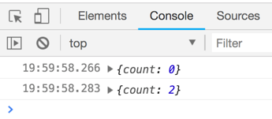
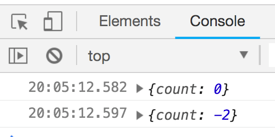
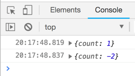
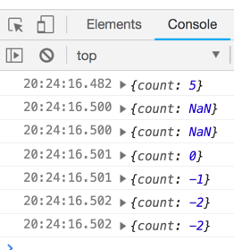
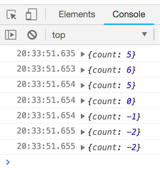
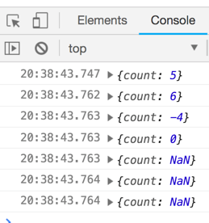
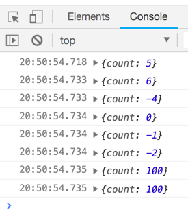
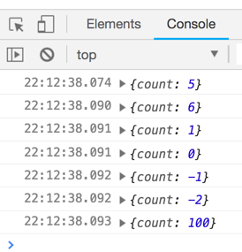

## Create store
```js
import {storeCreator, createStore} from "redux";

const store = createStore((state={count:0})=>{
  return state
});

console.log(store.getState());
```
## Change store using action
> action is an object that get to sent to the store.

> I would like to increment the count
```js
{
  type: 'INCREMENT'
}

```
> How do I send this action to the store
store.dispatch(
  {
  type: 'INCREMENT'
  }
)

> When we dispatch an action to the store something happen. Let us see by loging

```js
import {storeCreator, createStore} from "redux";

const store = createStore((state={count:0})=>{
  console.log('running');
  return state
});

console.log(store.getState());

store.dispatch(
  {
  type: 'INCREMENT'
  }
)
```
> for every dispatch store function is running
 
## Pass the seconde argument `action`

```js
import {storeCreator, createStore} from "redux";

const store = createStore((state={count:0}, action)=>{
  console.log(action);
  return state
});

console.log(store.getState());

store.dispatch(
  {
  type: 'INCREMENT'
  }
)
```
 

## increment counter if action type is 'INCREMENT'
```js
import { storeCreator, createStore } from "redux";

const store = createStore((state = { count: 0 }, action) => {
  if (action.type === "INCREMENT") {
    return {
      count: state.count + 1
    };
  } else return state;
});

console.log(store.getState());

store.dispatch({
  type: "INCREMENT"
});

console.log(store.getState());
```
 

## Add one more dispatch to increment the counter
```js
import { storeCreator, createStore } from "redux";

const store = createStore((state = { count: 0 }, action) => {
  if (action.type === "INCREMENT") {
    return {
      count: state.count + 1
    };
  } else return state;
});

console.log(store.getState());

store.dispatch({
  type: "INCREMENT"
});

store.dispatch({
  type: "INCREMENT"
});

console.log(store.getState());
```
 

## replace if with switch
```js
import { storeCreator, createStore } from "redux";

const store = createStore((state = { count: 0 }, action) => {
  switch (action.type) {
    case 'INCREMENT':
      return {
        count: state.count + 1
      }
    default:
      return state;
  }
});

console.log(store.getState());

store.dispatch({
  type: "INCREMENT"
});

store.dispatch({
  type: "INCREMENT"
});

store.dispatch({
  type: "DECREMENT"
});

store.dispatch({
  type: "RESET"
});

store.dispatch({
  type: "DECREMENT"
});

store.dispatch({
  type: "DECREMENT"
});

console.log(store.getState());
```
 

## Implement 'DECREMENT' & 'RESET' actions
```js
import { storeCreator, createStore } from "redux";

const store = createStore((state = { count: 0 }, action) => {
  switch (action.type) {
    case 'INCREMENT':
      return {
        count: state.count + 1
      }
    case 'DECREMENT':
      return {
        count: state.count - 1
      }
    case 'RESET': 
      return {
        count: 0
      }
    default:
      return state;
  }
});

console.log(store.getState());

store.dispatch({
  type: "INCREMENT"
});

store.dispatch({
  type: "INCREMENT"
});

store.dispatch({
  type: "DECREMENT"
});

store.dispatch({
  type: "RESET"
});

store.dispatch({
  type: "DECREMENT"
});

store.dispatch({
  type: "DECREMENT"
});

console.log(store.getState());
```
 

## Use store.subscribe() 
```js
store.subscribe(()=>{
// run every time the store state changes. 
})
```
> use to log store state
```js
store.subscribe(() => {
  console.log(store.getState());
});
```

## How do we stop subscription
> call return value of subscribe
```js
const unsubscribe = store.subscribe(() => {
  console.log(store.getState());
});
unsubscribe();
```
```js
import { storeCreator, createStore } from "redux";

const store = createStore((state = { count: 0 }, action) => {
  switch (action.type) {
    case 'INCREMENT':
      return {
        count: state.count + 1
      }
    case 'DECREMENT':
      return {
        count: state.count - 1
      }
    case 'RESET': 
      return {
        count: 0
      }
    default:
      return state;
  }
});
const unsubscribe = store.subscribe(() => {
  console.log(store.getState());
});

store.dispatch({
  type: "INCREMENT"
});
unsubscribe();
store.dispatch({
  type: "INCREMENT"
});

store.dispatch({
  type: "DECREMENT"
});

store.dispatch({
  type: "RESET"
});

store.dispatch({
  type: "DECREMENT"
});

store.dispatch({
  type: "DECREMENT"
});

console.log(store.getState());

```
 

## How to pass data more than type in an action
> Increment by 5

```js
import { storeCreator, createStore } from "redux";

const store = createStore((state = { count: 0 }, action) => {
  switch (action.type) {
    case 'INCREMENT':
      return {
        count: state.count + action.incrementBy
      }
    case 'DECREMENT':
      return {
        count: state.count - 1
      }
    case 'RESET': 
      return {
        count: 0
      }
    default:
      return state;
  }
});
const unsubscribe = store.subscribe(() => {
  console.log(store.getState());
});

store.dispatch({
  type: "INCREMENT",
  incrementBy: 5
});
// unsubscribe();
store.dispatch({
  type: "INCREMENT"
});

store.dispatch({
  type: "DECREMENT"
});

store.dispatch({
  type: "RESET"
});

store.dispatch({
  type: "DECREMENT"
});

store.dispatch({
  type: "DECREMENT"
});

console.log(store.getState());

```
 
## Fix NaN
```js
const store = createStore((state = { count: 0 }, action) => {
  switch (action.type) {
    case 'INCREMENT':
      const incrementBy = typeof action.incrementBy === "number" ? action.incrementBy : 1;
      return {
        count: state.count + incrementBy
      }
    case 'DECREMENT':
      return {
        count: state.count - 1
      }
    case 'RESET': 
      return {
        count: 0
      }
    default:
      return state;
  }
});
```
 

## Decrement by 10
```js
const store = createStore((state = { count: 0 }, action) => {
  switch (action.type) {
    case 'INCREMENT':
      const incrementBy = typeof action.incrementBy === "number" ? action.incrementBy : 1;
      return {
        count: state.count + incrementBy
      }
    case 'DECREMENT':
      return {
        count: state.count - action.decrementBy
      }
    case 'RESET': 
      return {
        count: 0
      }
    default:
      return state;
  }
});
```
 
## Fix error
```js
import { storeCreator, createStore } from "redux";

const store = createStore((state = { count: 0 }, action) => {
  switch (action.type) {
    case 'INCREMENT':
      const incrementBy = typeof action.incrementBy === "number" ? action.incrementBy : 1;
      return {
        count: state.count + incrementBy
      }
    case 'DECREMENT':
      const decrementBy = typeof action.decrementBy === "number" ? action.decrementBy : -1;
      return {
        count: state.count - decrementBy
      }
    case 'RESET': 
      return {
        count: 0
      }
    default:
      return state;
  }
});
const unsubscribe = store.subscribe(() => {
  console.log(store.getState());
});

store.dispatch({
  type: "INCREMENT",
  incrementBy: 5
});
// unsubscribe();
store.dispatch({
  type: "INCREMENT"
});

store.dispatch({
  type: "DECREMENT",
  decrementBy: 10
});

store.dispatch({
  type: "RESET"
});

store.dispatch({
  type: "DECREMENT"
});

store.dispatch({
  type: "DECREMENT"
});

console.log(store.getState());
```

## add an action to set any number 'SET'
```js
import { storeCreator, createStore } from "redux";

const store = createStore((state = { count: 0 }, action) => {
  switch (action.type) {
    case 'INCREMENT':
      const incrementBy = typeof action.incrementBy === "number" ? action.incrementBy : 1;
      return {
        count: state.count + incrementBy
      }
    case 'DECREMENT':
      const decrementBy = typeof action.decrementBy === "number" ? action.decrementBy : 1;
      return {
        count: state.count - decrementBy
      }
    case 'RESET': 
      return {
        count: 0
      }
    case 'SET': 
      const startNumber = typeof action.startNumber === "number"? action.startNumber: 0
      return {
        count: startNumber
      }
    default:
      return state;
  }
});
const unsubscribe = store.subscribe(() => {
  console.log(store.getState());
});

store.dispatch({
  type: "INCREMENT",
  incrementBy: 5
});
// unsubscribe();
store.dispatch({
  type: "INCREMENT"
});

store.dispatch({
  type: "DECREMENT",
  decrementBy: 10
});

store.dispatch({
  type: "RESET"
});

store.dispatch({
  type: "DECREMENT"
});

store.dispatch({
  type: "DECREMENT"
});

store.dispatch({
  type: 'SET',
  startNumber:100
});
console.log(store.getState());
```
 

## Refactoring and organizing using action generators
> Action generators are functions that return action objects

> Create action generator function to generate 'INCREMENT' actions
```js
const incrementCount = () => {
  return {
    type: 'INCREMENT'
  };
};
```
> Or with a shorthand syntax

```js
const incrementCount = () => ({
  type: 'INCREMENT'
});
```
> call action using the 
```js
store.dispatch(incrementCount());
```
## How do we use action generator with custom data
```js
store.dispatch(incrementCount({incrementBy:5}));
```
> action creator will be 
```js
const incrementCount = (payload = {}) => ({
  type: 'INCREMENT',
  incrementBy: typeof payload.incrementBy === "number" ? payload.incrementBy : 1
});
```
> switch function do not need the const. It is handled in the action creator.
```js
case 'INCREMENT':
      const incrementBy = typeof action.incrementBy === "number" ? action.incrementBy : 1;
      return {
        count: state.count + incrementBy
      }
```
TO
```js
  case 'INCREMENT':
      return {
        count: state.count + action.incrementBy
      };
```
## Destructure action creator
```js
const incrementCount = (payload = {}) => ({
  type: 'INCREMENT',
  incrementBy: typeof payload.incrementBy === "number" ? payload.incrementBy : 1
});
```
```js
const incrementCount = ({incrementBy} = {}) => ({
  type: 'INCREMENT',
  incrementBy: typeof incrementBy === "number" ? incrementBy : 1
});
```
> set default value when destructuring
```js
const incrementCount = ({incrementBy = 1} = {}) => ({
  type: 'INCREMENT',
  incrementBy: typeof incrementBy === "number" ? incrementBy : 1
});
```

```js
typeof incrementBy === "number" ? incrementBy : 1
// incrementBy is set to default value of 1 when destructuring. If it is not defined it will default to 1. So 
`incrementBy` is equal to `typeof incrementBy === "number" ? incrementBy : 1`

```
SO
```js
const incrementCount = ({incrementBy = 1} = {}) => ({
  type: 'INCREMENT',
  incrementBy: incrementBy
});
```
> In an object if the key and value s are same `incrementBy: incrementBy` es equal to `incrementBy`

Finally
```js
const incrementCount = ({incrementBy = 1} = {}) => ({
  type: 'INCREMENT',
  incrementBy
});
```
## Generate action generator for decrementCount
```js
import { storeCreator, createStore } from 'redux';

const incrementCount = ({incrementBy = 1} = {}) => ({
  type: 'INCREMENT',
  incrementBy
});
const decrementCount = ({ decrementBy = 1 } = {}) =>({
  type: 'DECREMENT',
  decrementBy
});
const setCount = ({ startNumber = 0 } = {}) =>({
  type: 'SET',
  startNumber
});
const resetCount = ({ resetBy = 1 } = {}) =>({
  type: 'RESET',
  resetBy
});


const store = createStore((state = { count: 0 }, action) => {
  switch (action.type) {
    case 'INCREMENT':
      
      return {
        count: state.count + action.incrementBy
      };
    case 'DECREMENT':
      return {
        count: state.count - action.decrementBy
      };
    case 'RESET':
      return {
        count: 0
      };
    case 'SET':
      
      return {
        count: action.startNumber
      };
    default:
      return state;
  }
});
const unsubscribe = store.subscribe(() => {
  console.log(store.getState());
});
store.dispatch(incrementCount({incrementBy:5}));
store.dispatch(incrementCount());
store.dispatch(decrementCount({decrementBy:5}));
store.dispatch(resetCount());
store.dispatch(decrementCount());
store.dispatch(decrementCount());
store.dispatch(setCount({startNumber: 100}));

```
 
