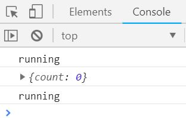
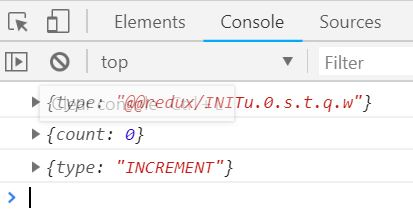
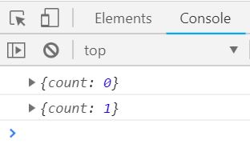
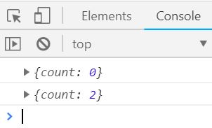

## Create store
```js
import {storeCreator, createStore} from "redux";

const store = createStore((state={count:0})=>{
  return state
});

console.log(store.getState());
```
## Chnge store using action
> action is an object that get to sent to the store.

> I would like to increment the count
```js
{
  type: 'INCREMENT'
}

```
> How do I send this action to the store
store.dispatch(
  {
  type: 'INCREMENT'
  }
)

> When we dispatch an action to the store something happen. Let us see by loging

```js
import {storeCreator, createStore} from "redux";

const store = createStore((state={count:0})=>{
  console.log('running');
  return state
});

console.log(store.getState());

store.dispatch(
  {
  type: 'INCREMENT'
  }
)
```
> for every dispatch store function is running
 
## Pass the seconed argument `action`

```js
import {storeCreator, createStore} from "redux";

const store = createStore((state={count:0}, action)=>{
  console.log(action);
  return state
});

console.log(store.getState());

store.dispatch(
  {
  type: 'INCREMENT'
  }
)
```
 

## increment counter if action type is 'INCREMENT'
```js
import { storeCreator, createStore } from "redux";

const store = createStore((state = { count: 0 }, action) => {
  if (action.type === "INCREMENT") {
    return {
      count: state.count + 1
    };
  } else return state;
});

console.log(store.getState());

store.dispatch({
  type: "INCREMENT"
});

console.log(store.getState());
```
 

## Add one more dispatch to increment the counter
```js
import { storeCreator, createStore } from "redux";

const store = createStore((state = { count: 0 }, action) => {
  if (action.type === "INCREMENT") {
    return {
      count: state.count + 1
    };
  } else return state;
});

console.log(store.getState());

store.dispatch({
  type: "INCREMENT"
});

store.dispatch({
  type: "INCREMENT"
});

console.log(store.getState());
```
 
