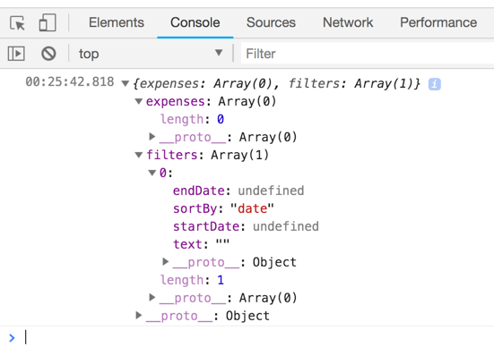

## Create state for expensify app
```js
const demoState = {
  expense: [{
    id: 'fgfgdfdg',
    description: 'March Rent',
    note: 'This is final payment for my house',
    amount: 540,
    createdAt: 0
  }],
  filters: {
    text: 'rent',
    sortBy: 'amount', // date or amount
    startDate: undefined,
    endDate: undefined
  }
};
```
## Actions we are going to create
```JS
ADD_EXPENSE
REMOVE_EXPENSE
EDIT_EXPENSE
SET_TEXT_FILTER
SORT_BY_DATE
SET_START_DATE
SET_END_DATE
```
> Setting up all of this actions in a single reducer is just not visible.

> So we will create two reducer one for expense and other for filter

## create expenses reducer
```js
const expensesReducerDefault = [];

const expenseReducer = (state=expensesReducerDefault, action) => {
  switch (action.type) {

    default:
      return state;
  }
}
```
## create a store
```js
import { createStore} from 'redux';

const expensesReducerDefault = [];

const expenseReducer = (state=expensesReducerDefault, action) => {
  switch (action.type) {

    default:
      return state;
  }
}
const store = createStore(expenseReducer);
console.log(store.getState());
const demoState = {
  expense: [{
    id: 'fgfgdfdg',
    description: 'March Rent',
    note: 'This is final payment for my house',
    amount: 540,
    createdAt: 0
  }],
  filters: {
    text: 'rent',
    sortBy: 'amount', // date or amount
    startDate: undefined,
    endDate: undefined
  }
};

```
 
> The empty array shows our store is  created but we do not want the store to be an array. We want expense to be an array. To do that we need to use combineReducer which will help us to combine multiple reducer.
> Combine reducer is a function and take an object with key value pair of each state name and its corresponding reducers
```js
const expensesReducerDefault = [];

const expensesReducer = (state=expensesReducerDefault, action) => {
  switch (action.type) {

    default:
      return state;
  }
}
const store = createStore(combineReducers({
  expenses:expensesReducer
}));
```
 
> Now the redux store is an object
## Create filters reducers with (text='', sortBy => 'date', startDate=>undefined, endDate=>undefined)
```js
// Filter Reducer
const filtersReducerDefault = [{text:'', sortBy :'date', startDate:undefined, endDate:undefined}];
const filtersReducer = (state=filtersReducerDefault, action) => {
  switch (action.type) {
    default:
      return state;
  }
}
```
> All 

```js
import { createStore, combineReducers} from 'redux';

const expensesReducerDefault = [];
// Expenses Reducer
const expensesReducer = (state=expensesReducerDefault, action) => {
  switch (action.type) {
    default:
      return state;
  }
}
// Filter Reducer
const filtersReducerDefault = [{text:'', sortBy :'date', startDate:undefined, endDate:undefined}];
const filtersReducer = (state=filtersReducerDefault, action) => {
  switch (action.type) {
    default:
      return state;
  }
}
// Store creation
const store = createStore(
  combineReducers({
    expenses: expensesReducer,
    filters:filtersReducer
}));
console.log(store.getState());
const demoState = {
  expenses: [{
    id: 'fgfgdfdg',
    description: 'March Rent',
    note: 'This is final payment for my house',
    amount: 540,
    createdAt: 0
  }],
  filters: {
    text: 'rent',
    sortBy: 'amount', // date or amount
    startDate: undefined,
    endDate: undefined
  }
};
```
 
